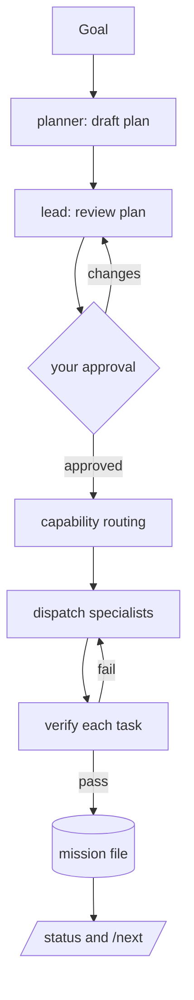

# Atelier

Agent-orchestration plugin for Claude Code. A lead agent reviews a plan, gates on your
approval, and routes each task to the specialist agent best matched by capability, while a
persistent mission file tracks the task board.


## How it differs from a skills library

Atelier is built around a lead coordinator, not a single agent reading skills. Agents
declare their capabilities; the lead routes tasks to them. The plan is reviewed by the lead
and approved by you before any work starts, and a mission file is the single source of
truth.

## Concepts

- **Capability registry** — every agent declares `capabilities`, a `layer`, and `task_kinds`; the lead routes by them.
- **Mission file** — the single source of truth for a run: goal, plan, a task table, and a decision log.
- **Capability routing** — a deterministic coarse filter (`layer` + `task_kind`) then a scored pick; the lead reads descriptions for the final nuance.
- **Approval gate** — the lead reviews the plan and you approve the task breakdown before any work starts.

## Pipeline



## Install

```bash
claude plugin marketplace add tunahanaliozturk/atelier
claude plugin install atelier
```

## Use

- `/orchestrate <goal>`: plan, lead-review, approve, then dispatch to specialists.
- `/plan <goal>`: plan and lead-review only, stop at approval.
- `/status`: show the current mission task board.
- `/next`: show the tasks that can start now (pending tasks whose dependencies are all done).
- `/crew`: show the crew — every agent with its layer, capabilities, and task kinds.
- `/resume`: continue the most recent mission from where it left off (no re-approval).
- `/retry [task-id]`: retry a blocked or failed task, or all blocked tasks.

## Example

```text
/orchestrate add rate limiting to the public API
```

The lead drafts and reviews a plan, then shows the mission for approval:

| ID | Description | Agent | Status | Deps |
| --- | --- | --- | --- | --- |
| t1 | Design the limiter and config | backend-engineer | pending | - |
| t2 | Implement the middleware | backend-engineer | pending | t1 |
| t3 | Add integration tests | qa-engineer | pending | t2 |

After approval, `/status` shows progress and the dependency graph; `/next` lists what can
start now (here, `t1`). As tasks finish, `/next` surfaces `t2`, then `t3`.

## Extend the crew

Add an agent under `agents/` following `docs/schemas/capability-schema.md`. The SessionStart
hook surfaces it automatically and the lead can route to it.
When no agent covers a task, the lead uses the writing-agents skill to scaffold one that
follows the schema.

## Develop

```bash
node --test
```
