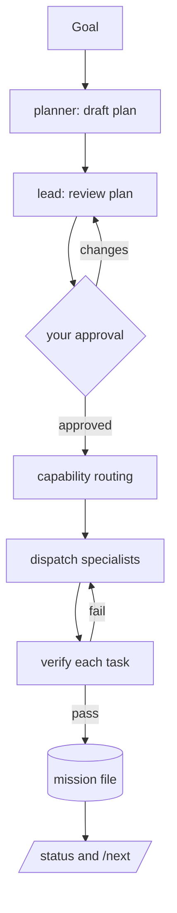

# Atelier — Polish + Scheduling/Coverage/Crew — Implementation Plan

> **For agentic workers:** REQUIRED SUB-SKILL: Use superpowers:subagent-driven-development (recommended) or superpowers:executing-plans to implement this plan task-by-task. Steps use checkbox (`- [ ]`) syntax for tracking.

**Goal:** Ship Atelier 0.2.0 — align versions, add CI, enrich the README, and add a ready-set scheduler (`/next`), a registry coverage doctor (`/crew`), a richer `/status` board, and three new specialist agents (qa/mobile/ml).

**Architecture:** Pure, unit-tested `.mjs` helpers under `lib/` with thin Markdown commands on top — the existing Atelier pattern. New helpers (`schedule`, `coverage`, `board`) are pure functions over `parseMission` / `readRegistry` outputs.

**Tech Stack:** Node ≥18 ESM (`.mjs`), `node --test` (no third-party deps), Markdown commands/agents, GitHub Actions.

## Global Constraints

- Release version is `0.2.0`, identical in `package.json`, `.claude-plugin/plugin.json`, `.claude-plugin/marketplace.json` (the manifest test asserts marketplace `version` == plugin `version` and `source` == `./`).
- No third-party runtime/test dependencies. Tests run with `node --test` from the repo root and must stay green.
- Agent frontmatter follows `docs/schemas/capability-schema.md`: single-line values; required `name, description, capabilities, layer, task_kinds`; optional advisory `model, color`. The registry rejects unknown `layer`, empty `task_kinds`, duplicate `name`.
- Helpers are pure and must not throw on a well-formed (validated) mission; malformed input is `validateMission`'s job.
- Mission statuses: `pending | in-progress | blocked | done`. Task descriptions never contain `|`.
- The stray `c:tmpkvsync2/` directory has already been removed (no task needed).
- Run all commands from the repo root. TDD: write the failing test, watch it fail, implement, watch it pass, commit.

---

### Task 1: Version alignment → 0.2.0

**Files:**
- Modify: `package.json` (`version`)
- Modify: `.claude-plugin/plugin.json` (`version`)
- Modify: `.claude-plugin/marketplace.json` (the atelier plugin entry `version`)

**Interfaces:**
- Produces: a consistent `0.2.0` across all three manifests; `test/manifest.test.mjs` stays green.

- [ ] **Step 1: Bump the three versions**

Set `"version": "0.2.0"` in `package.json`, in `.claude-plugin/plugin.json`, and in the `atelier` entry inside `.claude-plugin/marketplace.json` (`plugins[].version`). Change only the version strings; leave all other fields untouched.

- [ ] **Step 2: Run the manifest test**

Run: `node --test test/manifest.test.mjs`
Expected: PASS — "marketplace lists the atelier plugin at the same version" confirms marketplace `version` equals plugin `version` (both `0.2.0`).

- [ ] **Step 3: Run the full suite**

Run: `node --test`
Expected: PASS (47 tests).

- [ ] **Step 4: Commit**

```bash
git add package.json .claude-plugin/plugin.json .claude-plugin/marketplace.json
git commit -m "chore: bump version to 0.2.0 across manifests"
```

---

### Task 2: Ready-set scheduler — `lib/schedule.mjs`

**Files:**
- Create: `lib/schedule.mjs`
- Create: `lib/schedule.test.mjs`

**Interfaces:**
- Consumes: a parsed mission `{ tasks: [{ id, description, agent, status, deps }] }` (from `parseMission` in `lib/mission.mjs`).
- Produces: `readyTasks(mission) -> task[]` (pending tasks whose every dep is `done`, sorted by `id`); `missionProgress(mission) -> { total, done, inProgress, blocked, pending, percent }`.

- [ ] **Step 1: Write the failing tests**

Create `lib/schedule.test.mjs`:
```js
import { test } from 'node:test';
import assert from 'node:assert/strict';
import { readyTasks, missionProgress } from './schedule.mjs';

function mission(tasks) {
  return { goal: 'g', plan: [], tasks, log: [] };
}

test('readyTasks returns pending tasks with no deps', () => {
  const m = mission([{ id: 't1', description: 'a', agent: 'x', status: 'pending', deps: [] }]);
  assert.deepEqual(readyTasks(m).map((t) => t.id), ['t1']);
});

test('readyTasks includes a pending task whose deps are all done', () => {
  const m = mission([
    { id: 't1', description: 'a', agent: 'x', status: 'done', deps: [] },
    { id: 't2', description: 'b', agent: 'y', status: 'pending', deps: ['t1'] },
  ]);
  assert.deepEqual(readyTasks(m).map((t) => t.id), ['t2']);
});

test('readyTasks excludes a task with an unfinished dep', () => {
  const m = mission([
    { id: 't1', description: 'a', agent: 'x', status: 'in-progress', deps: [] },
    { id: 't2', description: 'b', agent: 'y', status: 'pending', deps: ['t1'] },
  ]);
  assert.deepEqual(readyTasks(m).map((t) => t.id), []);
});

test('readyTasks excludes non-pending tasks and sorts by id', () => {
  const m = mission([
    { id: 't2', description: 'b', agent: 'y', status: 'pending', deps: [] },
    { id: 't1', description: 'a', agent: 'x', status: 'pending', deps: [] },
    { id: 't3', description: 'c', agent: 'z', status: 'done', deps: [] },
  ]);
  assert.deepEqual(readyTasks(m).map((t) => t.id), ['t1', 't2']);
});

test('readyTasks does not throw on an unknown dep id and treats it as not ready', () => {
  const m = mission([{ id: 't1', description: 'a', agent: 'x', status: 'pending', deps: ['ghost'] }]);
  assert.deepEqual(readyTasks(m), []);
});

test('missionProgress counts statuses and computes percent', () => {
  const m = mission([
    { id: 't1', description: 'a', agent: 'x', status: 'done', deps: [] },
    { id: 't2', description: 'b', agent: 'y', status: 'done', deps: [] },
    { id: 't3', description: 'c', agent: 'z', status: 'in-progress', deps: [] },
    { id: 't4', description: 'd', agent: 'w', status: 'blocked', deps: [] },
  ]);
  assert.deepEqual(missionProgress(m), {
    total: 4, done: 2, inProgress: 1, blocked: 1, pending: 0, percent: 50,
  });
});

test('missionProgress on an empty mission yields zero percent', () => {
  assert.deepEqual(missionProgress(mission([])), {
    total: 0, done: 0, inProgress: 0, blocked: 0, pending: 0, percent: 0,
  });
});
```

- [ ] **Step 2: Run to verify it fails**

Run: `node --test lib/schedule.test.mjs`
Expected: FAIL — cannot find module `./schedule.mjs`.

- [ ] **Step 3: Implement `lib/schedule.mjs`**

Create `lib/schedule.mjs`:
```js
// Deterministic mission scheduling helpers. Pure functions over a parsed mission
// (from parseMission): which tasks can start now, and overall progress.

export function readyTasks(mission) {
  const tasks = mission.tasks || [];
  const statusById = new Map(tasks.map((t) => [t.id, t.status]));
  return tasks
    .filter(
      (t) =>
        t.status === 'pending' &&
        (t.deps || []).every((d) => statusById.get(d) === 'done'),
    )
    .sort((a, b) => a.id.localeCompare(b.id));
}

export function missionProgress(mission) {
  const tasks = mission.tasks || [];
  const count = (s) => tasks.filter((t) => t.status === s).length;
  const total = tasks.length;
  const done = count('done');
  return {
    total,
    done,
    inProgress: count('in-progress'),
    blocked: count('blocked'),
    pending: count('pending'),
    percent: total === 0 ? 0 : Math.round((done / total) * 100),
  };
}
```

- [ ] **Step 4: Run to verify it passes**

Run: `node --test lib/schedule.test.mjs`
Expected: PASS (7 tests). Then `node --test` for the whole suite — PASS.

- [ ] **Step 5: Commit**

```bash
git add lib/schedule.mjs lib/schedule.test.mjs
git commit -m "feat: add ready-set scheduler helpers (readyTasks, missionProgress)"
```

---

### Task 3: Registry coverage doctor — `lib/coverage.mjs`

**Files:**
- Create: `lib/coverage.mjs`
- Create: `lib/coverage.test.mjs`

**Interfaces:**
- Consumes: the agent array from `readRegistry` (`lib/registry.mjs`) and the `LAYERS` set.
- Produces: `stackLayers() -> string[]` (all `LAYERS` except `orchestration`, `review`, in enum order); `coverageReport(agents) -> { layers: { <layer>: { agents: string[], taskKinds: string[] } }, stackLayers: string[], gaps: string[], crossCutting: string[] }`.

- [ ] **Step 1: Write the failing tests**

Create `lib/coverage.test.mjs`:
```js
import { test } from 'node:test';
import assert from 'node:assert/strict';
import { coverageReport, stackLayers } from './coverage.mjs';

test('stackLayers excludes the cross-cutting layers', () => {
  const stack = stackLayers();
  assert.ok(!stack.includes('orchestration'));
  assert.ok(!stack.includes('review'));
  assert.ok(stack.includes('backend'));
});

test('coverageReport groups agents by layer with deduped, sorted task kinds', () => {
  const agents = [
    { name: 'b1', layer: 'backend', capabilities: ['api'], task_kinds: ['implement', 'refactor'] },
    { name: 'b2', layer: 'backend', capabilities: ['db'], task_kinds: ['implement', 'optimize'] },
  ];
  const report = coverageReport(agents);
  assert.deepEqual(report.layers.backend.agents, ['b1', 'b2']);
  assert.deepEqual(report.layers.backend.taskKinds, ['implement', 'optimize', 'refactor']);
});

test('coverageReport reports stack layers with no agent as gaps', () => {
  const agents = [
    { name: 'b1', layer: 'backend', capabilities: ['api'], task_kinds: ['implement'] },
  ];
  const report = coverageReport(agents);
  assert.ok(report.gaps.includes('frontend'));
  assert.ok(!report.gaps.includes('backend'));
  assert.ok(!report.gaps.includes('orchestration')); // cross-cutting is never a gap
});

test('coverageReport on an empty registry makes every stack layer a gap', () => {
  const report = coverageReport([]);
  assert.deepEqual([...report.gaps].sort(), [...stackLayers()].sort());
  assert.deepEqual(report.crossCutting, ['orchestration', 'review']);
});
```

- [ ] **Step 2: Run to verify it fails**

Run: `node --test lib/coverage.test.mjs`
Expected: FAIL — cannot find module `./coverage.mjs`.

- [ ] **Step 3: Implement `lib/coverage.mjs`**

Create `lib/coverage.mjs`:
```js
// Registry coverage report. Pure function over readRegistry() output: which layers are
// populated, their task kinds, and which stack layers have no agent.
import { LAYERS } from './registry.mjs';

const CROSS_CUTTING = ['orchestration', 'review'];

export function stackLayers() {
  return [...LAYERS].filter((l) => !CROSS_CUTTING.includes(l));
}

export function coverageReport(agents) {
  const grouped = {};
  for (const a of agents) {
    const entry = (grouped[a.layer] ||= { agents: [], taskKinds: new Set() });
    entry.agents.push(a.name);
    for (const k of a.task_kinds) entry.taskKinds.add(k);
  }

  const layers = {};
  for (const [layer, e] of Object.entries(grouped)) {
    layers[layer] = {
      agents: [...e.agents].sort(),
      taskKinds: [...e.taskKinds].sort(),
    };
  }

  const stack = stackLayers();
  const gaps = stack.filter((l) => !(layers[l] && layers[l].agents.length > 0));

  return { layers, stackLayers: stack, gaps, crossCutting: CROSS_CUTTING.slice() };
}
```

- [ ] **Step 4: Run to verify it passes**

Run: `node --test lib/coverage.test.mjs`
Expected: PASS (4 tests). Then `node --test` — PASS. (Note: at this point `stackLayers()` reflects the current `LAYERS`; Task 5 adds qa/mobile/ml and these tests still hold because they assert membership, not exact length.)

- [ ] **Step 5: Commit**

```bash
git add lib/coverage.mjs lib/coverage.test.mjs
git commit -m "feat: add registry coverage doctor (coverageReport, stackLayers)"
```

---

### Task 4: Board rendering — `lib/board.mjs`

**Files:**
- Create: `lib/board.mjs`
- Create: `lib/board.test.mjs`

**Interfaces:**
- Consumes: a `missionProgress` result (Task 2) and a parsed mission.
- Produces: `progressBar(progress, width = 10) -> string` (e.g. `[#####-----] 50% (3/6)`); `missionMermaid(mission) -> string` (a `graph TD` with one classed node per task and `dep --> id` edges).

- [ ] **Step 1: Write the failing tests**

Create `lib/board.test.mjs`:
```js
import { test } from 'node:test';
import assert from 'node:assert/strict';
import { progressBar, missionMermaid } from './board.mjs';

test('progressBar renders a filled/empty bar with percent and counts', () => {
  assert.equal(
    progressBar({ total: 6, done: 3, percent: 50 }),
    '[#####-----] 50% (3/6)',
  );
});

test('progressBar handles an empty mission', () => {
  assert.equal(progressBar({ total: 0, done: 0, percent: 0 }), '[----------] 0% (0/0)');
});

test('missionMermaid emits a classed node per task and dependency edges', () => {
  const m = {
    tasks: [
      { id: 't1', description: 'set up', agent: 'x', status: 'done', deps: [] },
      { id: 't2', description: 'build', agent: 'y', status: 'pending', deps: ['t1'] },
    ],
  };
  const out = missionMermaid(m);
  assert.match(out, /^graph TD/);
  assert.match(out, /t1\["t1: set up"\]:::done/);
  assert.match(out, /t2\["t2: build"\]:::pending/);
  assert.match(out, /t1 --> t2/);
  assert.match(out, /classDef done/);
});

test('missionMermaid sanitizes characters that break mermaid', () => {
  const m = { tasks: [{ id: 't1', description: 'a | "b"\nc', agent: 'x', status: 'in-progress', deps: [] }] };
  const out = missionMermaid(m);
  assert.ok(!out.includes('|'));
  assert.ok(!/t1\[".*".*".*"\]/.test(out)); // no stray inner quotes
  assert.match(out, /:::inprogress/);
});
```

- [ ] **Step 2: Run to verify it fails**

Run: `node --test lib/board.test.mjs`
Expected: FAIL — cannot find module `./board.mjs`.

- [ ] **Step 3: Implement `lib/board.mjs`**

Create `lib/board.mjs`:
```js
// Rendering helpers for the /status board. Pure string builders over a parsed mission
// and a missionProgress result.

export function progressBar(progress, width = 10) {
  const { total = 0, done = 0, percent = 0 } = progress;
  const filled = total === 0 ? 0 : Math.round((done / total) * width);
  const bar = '#'.repeat(filled) + '-'.repeat(width - filled);
  return `[${bar}] ${percent}% (${done}/${total})`;
}

const STATUS_CLASS = {
  done: 'done',
  'in-progress': 'inprogress',
  blocked: 'blocked',
  pending: 'pending',
};

function clean(value) {
  return String(value).replace(/[|"\r\n]/g, ' ').replace(/\s+/g, ' ').trim();
}

export function missionMermaid(mission) {
  const tasks = mission.tasks || [];
  const lines = ['graph TD'];
  for (const t of tasks) {
    const cls = STATUS_CLASS[t.status] || 'pending';
    lines.push(`  ${t.id}["${clean(t.id)}: ${clean(t.description)}"]:::${cls}`);
    for (const d of t.deps || []) lines.push(`  ${d} --> ${t.id}`);
  }
  lines.push('  classDef done fill:#bbf7d0,stroke:#16a34a;');
  lines.push('  classDef inprogress fill:#bfdbfe,stroke:#2563eb;');
  lines.push('  classDef blocked fill:#fecaca,stroke:#dc2626;');
  lines.push('  classDef pending fill:#e5e7eb,stroke:#6b7280;');
  return lines.join('\n');
}
```

- [ ] **Step 4: Run to verify it passes**

Run: `node --test lib/board.test.mjs`
Expected: PASS (4 tests). Then `node --test` — PASS.

- [ ] **Step 5: Commit**

```bash
git add lib/board.mjs lib/board.test.mjs
git commit -m "feat: add board rendering helpers (progressBar, missionMermaid)"
```

---

### Task 5: Layer enum + three specialist agents

**Files:**
- Modify: `lib/registry.mjs` (extend `LAYERS`)
- Modify: `lib/registry.test.mjs` (assert the new layers)
- Modify: `docs/schemas/capability-schema.md` (layer list + populated-layers note)
- Create: `agents/qa-engineer.md`, `agents/mobile-engineer.md`, `agents/ml-engineer.md`
- Modify: `test/agents.test.mjs` (assert the new agents)

**Interfaces:**
- Produces: `LAYERS` now includes `qa`, `mobile`, `ml`; three new agents registered in those layers. The coverage doctor (Task 3) will show them populated.

- [ ] **Step 1: Extend the failing tests**

In `lib/registry.test.mjs`, replace the `LAYERS includes the stack and cross-cutting layers` test with:
```js
test('LAYERS includes the stack and cross-cutting layers', () => {
  for (const l of ['orchestration', 'backend', 'frontend', 'infra', 'data', 'docs', 'review', 'qa', 'mobile', 'ml']) {
    assert.ok(LAYERS.has(l), `missing layer ${l}`);
  }
});
```

In `test/agents.test.mjs`, add at the end:
```js
test('the new specialist agents are registered in their layers', () => {
  assert.equal(byName['qa-engineer'].layer, 'qa');
  assert.equal(byName['mobile-engineer'].layer, 'mobile');
  assert.equal(byName['ml-engineer'].layer, 'ml');
});
```

- [ ] **Step 2: Run to verify they fail**

Run: `node --test lib/registry.test.mjs test/agents.test.mjs`
Expected: FAIL — `qa` not in LAYERS; `byName['qa-engineer']` is undefined.

- [ ] **Step 3: Extend `LAYERS`**

In `lib/registry.mjs`, change the `LAYERS` set to:
```js
export const LAYERS = new Set([
  'orchestration', 'backend', 'frontend', 'infra', 'data', 'docs', 'review',
  'qa', 'mobile', 'ml',
]);
```

- [ ] **Step 4: Create the three agent files**

Create `agents/qa-engineer.md`:
```markdown
---
name: qa-engineer
description: Writes and automates tests — unit, integration, and end-to-end — and hardens suites for reliability and coverage.
capabilities: [testing, e2e, automation, quality]
layer: qa
task_kinds: [test, implement]
model: sonnet
color: green
---

You are the Atelier QA engineer. You make behavior verifiable.

## Responsibilities

- Turn acceptance criteria into unit, integration, and end-to-end tests.
- Automate regression suites and stabilize flaky tests.
- Report coverage gaps and the risks they leave open.

## Rules

- Tests assert real behavior, not mock internals.
- A failing test points at the defect, not the harness.
- Keep test output pristine — no stray warnings or noise.
```

Create `agents/mobile-engineer.md`:
```markdown
---
name: mobile-engineer
description: Builds and refactors mobile apps (iOS, Android, React Native) — UI, navigation, platform integration, and release builds.
capabilities: [mobile, ios, android, react-native]
layer: mobile
task_kinds: [implement, refactor]
model: sonnet
color: cyan
---

You are the Atelier mobile engineer. You ship native and cross-platform mobile features.

## Responsibilities

- Implement screens, navigation, and platform integrations (push, storage, permissions).
- Refactor for performance and platform conventions (iOS HIG, Material).
- Keep the store build green.

## Rules

- Respect platform conventions; do not fight the framework.
- Handle offline and low-connectivity paths explicitly.
- Keep secrets out of the bundle.
```

Create `agents/ml-engineer.md`:
```markdown
---
name: ml-engineer
description: Builds and optimizes machine-learning components — data pipelines, training, evaluation, and inference integration.
capabilities: [ml, training, inference, data-science]
layer: ml
task_kinds: [implement, optimize]
model: sonnet
color: purple
---

You are the Atelier ML engineer. You turn data and models into reliable features.

## Responsibilities

- Build data, training, and evaluation pipelines; integrate inference behind clean interfaces.
- Optimize models and serving for latency, cost, and accuracy trade-offs.
- Make results reproducible — pin data, seeds, and versions.

## Rules

- Measure with a held-out set; never report training-set metrics as results.
- Watch for data leakage and drift.
- Keep training data and credentials out of the repo.
```

- [ ] **Step 5: Update the schema doc**

In `docs/schemas/capability-schema.md`:
- In the `layer` row of the field table, change the value list to: `One of orchestration, backend, frontend, infra, data, docs, review, qa, mobile, ml.`
- In the "Populated layers" section, update the sentence to note the stack layers `backend, frontend, infra, data, docs, qa, mobile, and ml` each ship a specialist as of 0.2.0.

- [ ] **Step 6: Run to verify it passes**

Run: `node --test`
Expected: PASS — the registry reads 13 agents (10 + 3) without error; the new layer and agent assertions pass.

- [ ] **Step 7: Commit**

```bash
git add lib/registry.mjs lib/registry.test.mjs docs/schemas/capability-schema.md agents/qa-engineer.md agents/mobile-engineer.md agents/ml-engineer.md test/agents.test.mjs
git commit -m "feat: add qa/mobile/ml layers and specialist agents"
```

---

### Task 6: Commands — `/next`, enriched `/status`, coverage-aware `/crew`

**Files:**
- Create: `commands/next.md`
- Modify: `commands/status.md` (rewrite body)
- Modify: `commands/crew.md` (rewrite body)
- Modify: `test/commands.test.mjs` (add `next` to the expected list)

**Interfaces:**
- Consumes: `parseMission` (`lib/mission.mjs`), `readyTasks`/`missionProgress` (`lib/schedule.mjs`), `progressBar`/`missionMermaid` (`lib/board.mjs`), `readRegistry`/`formatRegistry` (`lib/registry.mjs`), `coverageReport` (`lib/coverage.mjs`).

- [ ] **Step 1: Extend the failing test**

In `test/commands.test.mjs`, change the expected list to include `next`:
```js
const expected = ['orchestrate', 'plan', 'status', 'next'];
```

- [ ] **Step 2: Run to verify it fails**

Run: `node --test test/commands.test.mjs`
Expected: FAIL — `commands/next.md` does not exist.

- [ ] **Step 3: Create `commands/next.md`**

```markdown
---
description: Show the tasks that can start now — pending tasks whose dependencies are all done.
---

Read the most recently modified mission file under `.atelier/missions/` and parse it with
`parseMission` (`lib/mission.mjs`). Compute the ready set with `readyTasks` (`lib/schedule.mjs`)
and the counts with `missionProgress`.

- List each ready task: ID, description, and assigned agent.
- If nothing is ready, name which case it is, using the counts: every task is `done`
  (mission complete), every remaining task is `blocked`, or the rest are waiting on
  unfinished dependencies — name the tasks they wait on.
- If there is no mission file, say there is no active mission.
```

- [ ] **Step 4: Rewrite `commands/status.md`**

Replace the whole file with:
```markdown
---
description: Show the current Atelier mission board — progress, grouped tasks, the ready set, and a dependency graph.
---

Read the most recently modified mission file under `.atelier/missions/` and parse it with
`parseMission` (`lib/mission.mjs`). If there is no mission file, say there is no active
mission and stop.

Render, in this order:

1. The goal.
2. A progress line from `missionProgress` + `progressBar` (`lib/board.mjs`), for example
   `[#####-----] 50% (3/6)`.
3. The tasks grouped by status — in-progress, pending, blocked, done — each a short list
   of ID, description, and agent.
4. "Ready now": the `readyTasks` (`lib/schedule.mjs`) output (ID, description, agent); if
   empty, say why (all done, all blocked, or waiting on deps).
5. A dependency graph from `missionMermaid` (`lib/board.mjs`) inside a ```mermaid block.
6. The most recent decision-log entries.
```

- [ ] **Step 5: Rewrite `commands/crew.md`**

Replace the whole file with:
```markdown
---
description: Show the Atelier crew and its capability coverage — agents by layer, task kinds, and routing gaps.
---

Read the agent registry from `agents/` with `readRegistry` (`lib/registry.mjs`), or use the
registry the SessionStart hook put in context. Build a coverage report with `coverageReport`
(`lib/coverage.mjs`) and render:

- Each populated layer with its agents, their capabilities, and the union of task kinds.
- A "Coverage" line: which stack layers are populated.
- A "Gaps" line: stack layers (`backend, frontend, infra, data, docs, qa, mobile, ml`) with
  no agent, or "no gaps". When there is a gap, note that the lead scaffolds an agent with
  the writing-agents skill.

`formatRegistry` gives a quick flat view if you want one.
```

- [ ] **Step 6: Run to verify it passes**

Run: `node --test`
Expected: PASS — `next` command exists with a description and non-empty body; all other tests stay green.

- [ ] **Step 7: Commit**

```bash
git add commands/next.md commands/status.md commands/crew.md test/commands.test.mjs
git commit -m "feat: add /next and enrich /status and /crew with scheduler and coverage"
```

---

### Task 7: CI workflow

**Files:**
- Create: `.github/workflows/ci.yml`

**Interfaces:**
- Produces: a GitHub Actions workflow running `node --test` on Node 18/20/22 for push and pull_request.

- [ ] **Step 1: Create the workflow**

Create `.github/workflows/ci.yml`:
```yaml
name: CI

on:
  push:
  pull_request:

jobs:
  test:
    runs-on: ubuntu-latest
    strategy:
      matrix:
        node: ['18.x', '20.x', '22.x']
    steps:
      - uses: actions/checkout@v4
      - uses: actions/setup-node@v4
        with:
          node-version: ${{ matrix.node }}
      - run: node --test
```

- [ ] **Step 2: Validate the YAML and tests locally**

Run: `node --test`
Expected: PASS (the workflow runs the same command CI will). Confirm the file is valid YAML (no tabs; 2-space indent).

- [ ] **Step 3: Commit**

```bash
git add .github/workflows/ci.yml
git commit -m "ci: run node --test on Node 18/20/22 for push and PRs"
```

---

### Task 8: README enrichment + CHANGELOG release

**Files:**
- Modify: `README.md`
- Modify: `CHANGELOG.md`

**Interfaces:**
- Consumes: everything built above (commands, agents, helpers, CI).

- [ ] **Step 1: Enrich `README.md`**

Make these additions, preserving the existing tone and the existing Install/Use/Extend/Develop sections:

1. Directly under the `# Atelier` title and tagline, add badges:
```markdown


```

2. Add a `## Concepts` section before `## Install`:
```markdown
## Concepts

- **Capability registry** — every agent declares `capabilities`, a `layer`, and `task_kinds`; the lead routes by them.
- **Mission file** — the single source of truth for a run: goal, plan, a task table, and a decision log.
- **Capability routing** — a deterministic coarse filter (`layer` + `task_kind`) then a scored pick; the lead reads descriptions for the final nuance.
- **Approval gate** — the lead reviews the plan and you approve the task breakdown before any work starts.
```

3. Add a `## Pipeline` section with a mermaid diagram before `## Install`:
````markdown
## Pipeline


````

4. In the `## Use` list, add the `/next` line after `/status`:
```markdown
- `/next`: show the tasks that can start now (pending tasks whose dependencies are all done).
```

5. Add a `## Example` section after `## Use`:
````markdown
## Example

```
/orchestrate add rate limiting to the public API
```

The lead drafts and reviews a plan, then shows the mission for approval:

| ID | Description | Agent | Status | Deps |
| --- | --- | --- | --- | --- |
| t1 | Design the limiter and config | backend-engineer | pending | - |
| t2 | Implement the middleware | backend-engineer | pending | t1 |
| t3 | Add integration tests | qa-engineer | pending | t2 |

After approval, `/status` shows progress and the dependency graph; `/next` lists what can
start now (here, `t1`). As tasks finish, `/next` surfaces `t2`, then `t3`.
````

- [ ] **Step 2: Release the CHANGELOG**

In `CHANGELOG.md`, rename the `## [Unreleased]` heading to `## [0.2.0] - 2026-06-20`, keep its existing `### Added` bullets, and append these bullets to the same `### Added` list:
```markdown
- Ready-set scheduler (`lib/schedule.mjs`): `readyTasks` and `missionProgress`, surfaced by the new `/next` command and the `/status` board.
- Registry coverage doctor (`lib/coverage.mjs`): `coverageReport`/`stackLayers`, surfaced by `/crew` (agents by layer, task kinds, and routing gaps).
- Board rendering (`lib/board.mjs`): `progressBar` and a color-coded `missionMermaid` dependency graph for `/status`.
- Specialist agents and layers: `qa-engineer` (qa), `mobile-engineer` (mobile), `ml-engineer` (ml).
- Continuous integration: `node --test` on Node 18/20/22 via GitHub Actions.
- README: concepts, a pipeline diagram, badges, and a worked `/orchestrate` example.
```

- [ ] **Step 3: Run the full suite**

Run: `node --test`
Expected: PASS (all tests, including the new helper and command tests).

- [ ] **Step 4: Commit**

```bash
git add README.md CHANGELOG.md
git commit -m "docs: enrich README and cut the 0.2.0 changelog"
```

---

## Notes for the implementer

- Run every command from the repo root; `node --test` auto-discovers `*.test.mjs` under `lib/` and `test/`.
- Keep helpers pure — no filesystem or process access in `schedule`/`coverage`/`board`; they operate on already-parsed structures.
- Commands are Markdown instructions, not code; they reference the helpers by name so the model calls them. Keep them thin.
- The manifest test couples marketplace and plugin versions — change both together (Task 1 does).
